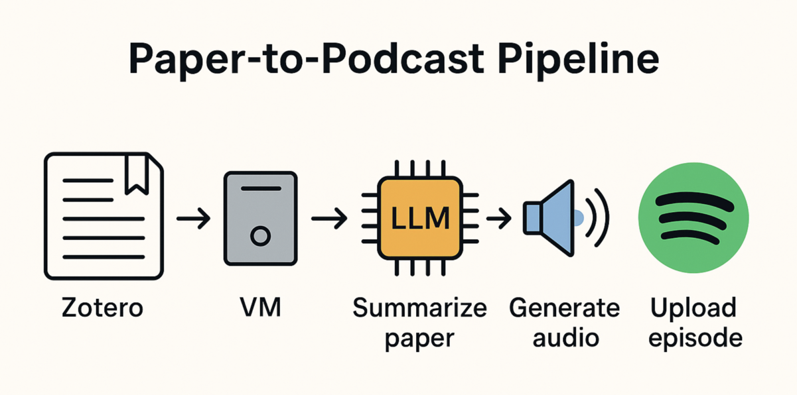

# Personalized Research Podcasts

An LLM system that automatically delivers daily personalized Spotify Postcasts from academic papers you bookmarked in Zotero.

> **Note:** This project is currently a work in progress and in proof-of-concept stage.

## Overview



The repo covers the following:
1. Fetches papers you've bookmarked in Zotero,
2. Uses GPT-4o to generate podcast-style summaries.
3. Converts these summaries to speech using AI TTS.
4. Creates a podcast feed that can be subscribed to in Spotify.

Once set up, you will get daily paper summaries based on your recent paper bookmarks!

## Setup Instructions

### S3 Bucket Setup

Create an S3 bucket (e.g. papers-podcast-bucket) with the following structure:
- `audio/` - Holds generated MP3 files
- `rss/` - Holds the podcast feed.xml file

Configure bucket hosting:
- Enable static website hosting on the bucket or serve through CloudFront.
- Make audio/ and rss/feed.xml public-read. A simple bucket policy with "Allow": "s3:GetObject" for those paths is sufficient.
- Verify https://<bucket-url>/rss/feed.xml loads in a browser.

### AWS Credentials Setup

To allow the app to upload files to your S3 bucket:

1. Create an IAM user with S3 access:
   - Go to [AWS IAM Console](https://console.aws.amazon.com/iam/)
   - Create a new user with programmatic access
   - Attach the `AmazonS3FullAccess` policy or a custom policy with access to your specific bucket

2. Get your credentials:
   - After creating the user, save the Access Key ID and Secret Access Key

3. Configure credentials on your machine:
   ```bash
   aws configure
   # Enter your Access Key ID and Secret Access Key when prompted
   # Set your default region (e.g., us-east-1)
   # Set output format (json recommended)
   ```

   Alternatively, create `~/.aws/credentials` with:
   ```
   [default]
   aws_access_key_id = YOUR_ACCESS_KEY
   aws_secret_access_key = YOUR_SECRET_KEY
   ```

   The app will automatically use these credentials when accessing S3.

### Local Environment Setup

```bash
# Install required packages (macOS)
brew install python ffmpeg poppler

# For Linux
# sudo apt update && sudo apt install -y python3-pip ffmpeg git poppler-utils

# Install mamba/conda
# Follow installation instructions for your OS from: https://github.com/conda-forge/miniforge

# Install required packages
mamba create -n p2p python=3.12
conda activate p2p
pip install -r requirements.txt
```

### Configuration

1. Copy `env.example` to `.env`
2. Fill in your API keys and configuration values:
   - OpenAI API key for GPT-4o and TTS
   - Zotero API key and user ID
   - S3 bucket name
   - Feed URL, author name, and podcast title

### Scheduling

Set up a cron job to run the script daily:

```bash
crontab -e
00 22 * * * /path/to/conda/envs/p2p/bin/python /path/to/zotero-paper-podcast/main.py
```

## Usage

1. Tag papers in Zotero with the "queue" tag
2. The system will process these papers at the scheduled time
3. After processing, papers are tagged as "processed"
4. Subscribe to your podcast feed in Spotify or any podcast app

### Adding the Feed to Spotify

1. Log in to Spotify for Podcasters → "Add or claim your podcast" → paste the FEED_URL.
2. Spotify polls the RSS every few hours; new episodes appear automatically.

### First Run Checklist

- Tag two papers in Zotero with "queue" to seed.
- Run python main.py manually and check S3 for the MP3 and updated feed.
- Add the feed to a podcast player and listen for audio quality issues.
- Tune voice, prompt length, or compression bitrate as desired.

## Security Notes

- Keep your `.env` file private and readable only by your user
- Rotate API keys periodically
- Configure OpenAI budget alerts

## TODO

- Use OpenAI assistant API to serve papers as attachments
- Ensure multi-paper jobs produce coherent podcast episodes
- Add support for conversation-based podcasts
- Update the feed file with new episodes (instead of resetting it to one episode)